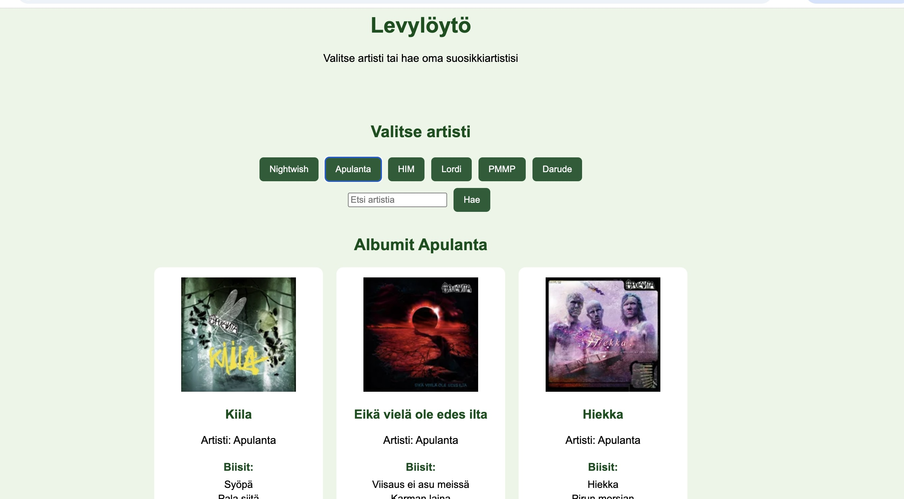

# Projektin nimi ja tekijät
AJAX-sovellus REST APIa hyödyntäen

## Verkkolinkit:
Pääset julkaistuun sovellukseen käsiksi osoitteessa https://musicinformationsite.netlify.app/

## Oma arvio työstä ja oman osaamisen kehittymisestä
Mielestäni onnistuin siinä, että sain sovelluksen hakemaan tietoa ulkoisesta API ja näyttämään sen sivulla selkeässä muodossa. Sovelluksessa käyttäjä voi valita artistin valmiista listasta tai hakea artistia itse hakukentän avulla. Albumien kuvat, nimet ja biisit näkyvät sivulla.

Parantamista olisi vielä koodin selkeydessä ja virhetilanteiden käsittelyssä. Sovelluksesta jäi puuttumaan esimerkiksi tarkempi ilmoitus käyttäjälle, jos artistia ei löydy tai API ei palauta kaikkia tietoja. Parantamista olisi myös aikataulussa, sillä palautin tämän myöhässä. 

Koen, että olen oppinut paremmin, miten AJAX/fetch toimii, miten JSON-dataa käsitellään ja miten API haettu tieto voidaan lisätä HTML-sivulle JavaScriptillä. 

## Palaute opettajalle kurssista sekä itse opetuksesta tähän saakka
Kaikki verkkotunnit ovat auttaneet paljon ja on myös mukava kun ne tallennetaan niin voi käydä katsomassa tunteja myös myöhemmin. Discrod ei ole ollut kauhean aktiivinen. 

## Sisällysluettelo:

- [Tietoja sovelluksesta](#tietoja-sovelluksesta)
- [Tunnetut virheet/bugit](#Tunnetut virheet/bugit)
- [Kuvakaappaukset](#kuvakaappaukset)
- [Teknologiat](#teknologiat)
- [Kiitokset](#kiitokset)
- [Lisenssi](#lisenssi)

## Tietoja sovelluksesta
Music Information Site (Levylöytö) on AJAX-sovellus, joka hyödyntää Last.fm REST APIa. Sovelluksessa käyttäjä voi valita artistin valmiista listasta tai hakea artistia hakukentän avulla.

## Tunnetut virheet/bugit
Kaikille albumeille ei välttämättä löydy biisilistaa Last.fm API.

## Kuvakaappaukset

## Teknologiat
Käytin seuraavia teknologioita: 

HTML: sivun rakenne
CSS: ulkoasu ja asettelu
JavaScript: toiminnallisuus ja API-haku
Fetch API: datan hakeminen Last.fm API
JSON: API palauttaman datan käsittely
Last.fm API: musiikkidatan hakeminen
Netlify: sovelluksen julkaisu verkkoon

## Kiitokset
Kurssimateriaali: AJAX ja REST API -sisällöt (https://mika-stenberg.gitbook.io/web-sovelluksia-javascriptin-avulla/4.-dom-skriptaus/dom-skriptauksen-perusteita)
Last.fm API
ChatGPT: käytin apuna koodin tarkistamiseen, virheiden etsimiseen

## Lisenssi
 MIT License
Copyright (c) 2026 Oona Sofia 
